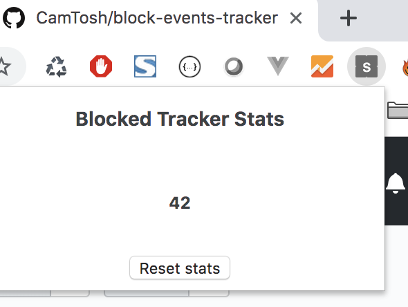

# Block Events Tracker

This extension block API call for report distracted student on quizz page.

After download, go to `chrome://extensions`, click on `LOAD UNPACKED` and select extension directory.

Event list : 

- `question_viewed`
- `question_flagged`
- `page_focused`
- `page_blurred`

